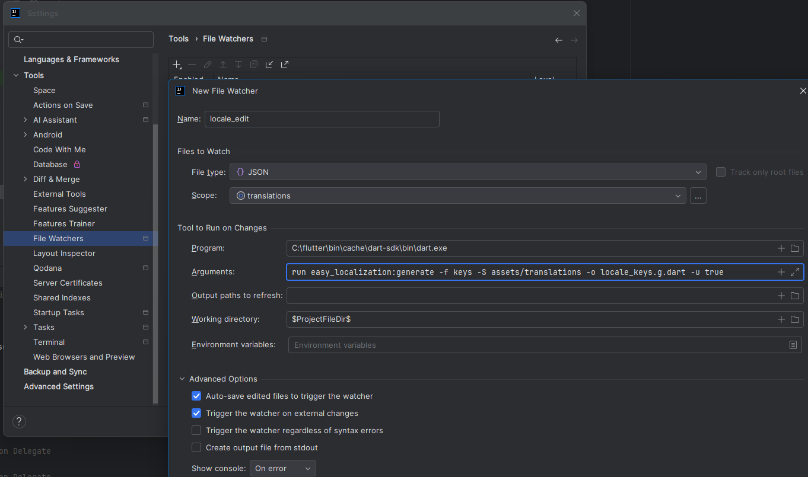
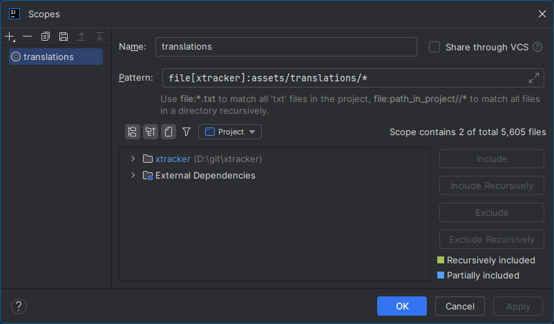
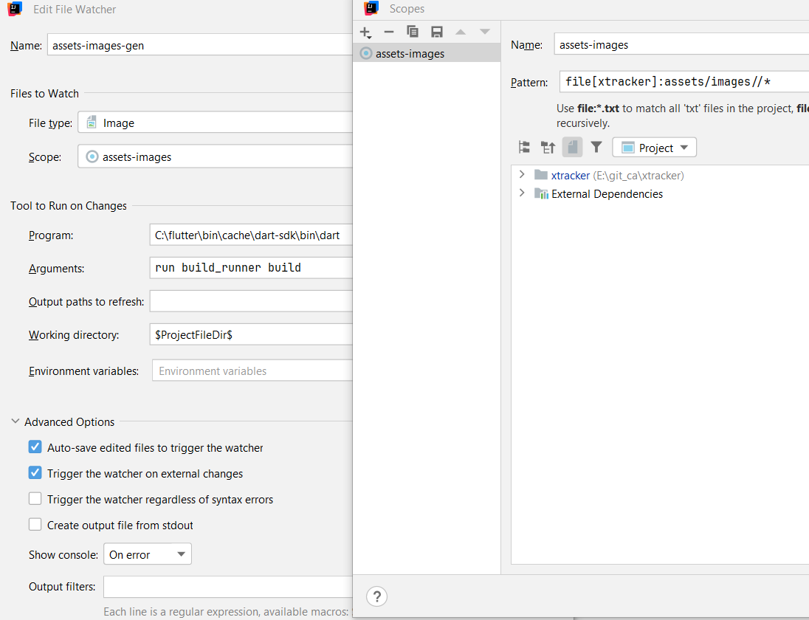

# xTracker

Generic tracker app

Skeleton by flutter create --org com.yourdomain -t skeleton your_app_name

## Assets

The `assets` directory houses images, translations, fonts, and any other files you want to
include with your application.

The `assets/images` directory contains [resolution-aware
images](https://flutter.dev/to/resolution-aware-images).

To compress png files use https://compresspng.com/

### Localization

#### Intl -> Date/Time

https://pub.dev/packages/intl

https://pub.dev/documentation/intl/latest/intl/DateFormat-class.html

#### easy localization

##### Generate keys

see: https://github.com/aissat/easy_localization/blob/develop/README.md#-code-generation

```shell
dart run easy_localization:generate -f keys -S assets/translations -o locale_keys.g.dart -u true
```

##### Auto generate keys when saving translation files with file watcher



scope-pattern:

```text
file[xtracker]:assets/translations//*
```

### Generate assets

Generate assets to use them in code with code completion/compiler warning:

```shell
dart run build_runner build
```

#### Auto generate assets.gen when saving pubspec.yaml


scope-pattern:

```text
file[xtracker]:assets/images//*
```

### Usage example

Direct as Img-Widget:

```flutter
Assets.images.logos.appLogo.image(fit: BoxFit.cover)
```

## Dependencies

### AppInfo

https://pub.dev/packages/package_info_plus

#### Usage

- Init AppInfo in main before running the app.
- Use AppInfo where needed.

```dart
import 'package:flutter_app_info/flutter_app_info.dart';

void main() async {
  WidgetsFlutterBinding.ensureInitialized();
  await AppInfo.init();
  runApp(const MyApp());
}

void doSomething() {
  const appName = AppInfo.appName;
}
```

### DeviceStorage

https://pub.dev/packages/flutter_secure_storage

### Translation

https://pub.dev/packages/easy_localization

### SimpleLogging

https://pub.dev/packages/path_provider
https://pub.dev/packages/flutter_archive
https://pub.dev/packages/logger
https://pub.dev/packages/share_plus

### UUId

https://pub.dev/packages/uuid

### Provider

https://pub.dev/packages/provider

### LinkedScrollController

https://pub.dev/packages/linked_scroll_controller

### Chart

https://pub.dev/packages/fl_chart

### Storage (Sembast)

for mobile
https://pub.dev/packages/sembast

for web
https://pub.dev/packages/sembast_web

(for desktop
https://pub.dev/packages/sembast_sqflite)

### File Picker

https://pub.dev/packages/file_picker

#### Setup

https://github.com/miguelpruivo/flutter_file_picker/wiki/Setup

### URL Launcher

https://pub.dev/packages/url_launcher

### Rich Text (for legal notice)

https://pub.dev/packages/simple_html_css

## App/Launcher Icon

Export app_logo.svg to android\app\src\main subfolders matching the sizes.

## Splashscreen

To modify the splashscreen install https://pub.dev/packages/flutter_native_splash

```shell
dart run flutter_native_splash:create
```

## Build apk (Android)

- Increase version in pubspec.yaml

### CPU special apk

- run `flutter build apk --split-per-abi`
- use e.g. `build\app\outputs\flutter-apk\app-arm64-v8a-release.apk`

### one apk bundle for all CPUs

- run `flutter build apk`
- use `build\app\outputs\flutter-apk\app-release.apk`

## IOS

### How to fix Using `ARCHS` setting to build architectures of target `Pods-Runner`

Pod-File ändern:

```
target 'Runner' do
  use_frameworks!
  use_modular_headers!

  flutter_install_all_ios_pods File.dirname(File.realpath(__FILE__))
end
```

Installation des pod-files (M1/M2-Chip) - Did you try:

- sudo gem install cocoapods
- sudo arch -x86_64 gem install ffi
- arch -x86_64 pod repo update
- arch -x86_64 pod install (im ios Verzeichnis auf Console ausführen!)

## Edit readme.md

https://stackedit.io/app#